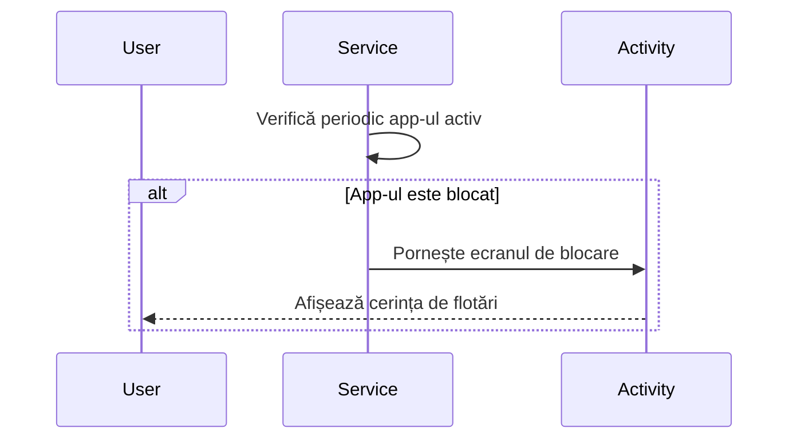
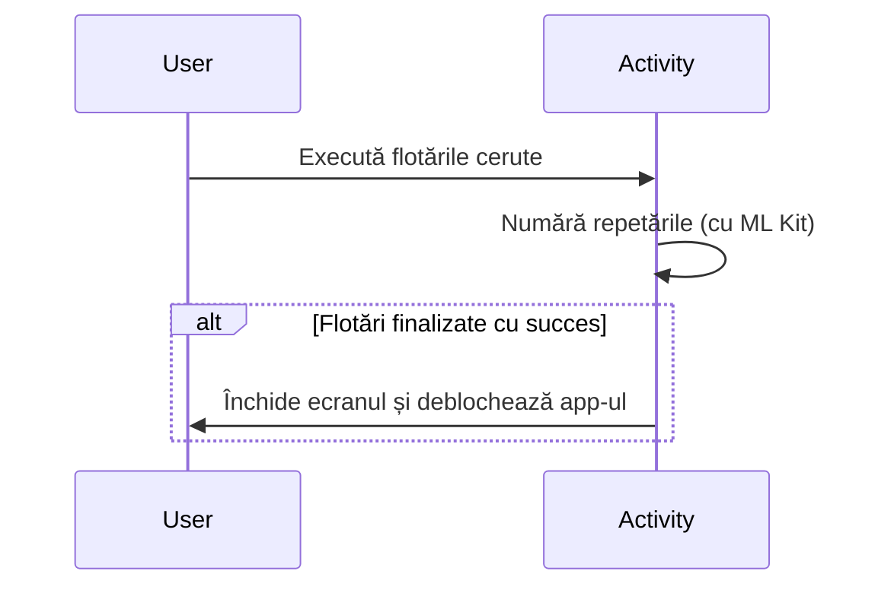
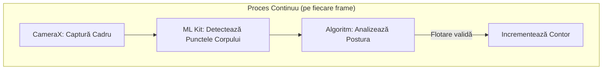

# App Locker

A presentation by:
- VOICU MARIO-CRISTIAN
- TUDOR CONSTANTIN-ALIN
- CHIRCEF DAN-ALEXANDRU
- POSPAI ALEXANDRU
- ZOTA ANDREI

---

# Motivația Alegerii Aplicației

- **1. Combaterea sedentarismului**
  - Utilizatorii petrec ore în șir pe social media (Instagram, TikTok). Prin condiționarea accesului de efectuarea unor flotări, transformi un obicei pasiv într-unul activ.

- **2. Gamificarea disciplinei**
  - Spre deosebire de un App Locker clasic care cere doar un PIN, acesta impune o barieră de efort. Dacă vrei neapărat să intri pe Facebook, trebuie să plătești cu efort fizic.

---
layout: center
---

# Aplicații Similare și Studiul Pieței
## Analiza concurenței

---

# Concurență: Efort Fizic Direct

- **PushUp Time / PushUpLock:**
  - Aplicații care blochează accesul la social media până când utilizatorul face un set de flotări.
  - Folosesc camera (AI) sau senzorul de proximitate pentru numărare.

---

# Concurență: Fitness General

- **Fitlock / StepBloc:**
  - Se bazează pe obiective de fitness generale (ex: trebuie să faci 5000 de pași ca să deblochezi YouTube pentru 15 minute).

---

# Concurență: Blocare Clasică

- **AppDetox / StayFocused:**
  - App lockere clasice care folosesc doar limite de timp sau parole.
  - Fără componentă de efort fizic (lipsește elementul de gamificare a sănătății).

---

# Cerințele și Funcționalitățile Aplicației

- **Selectarea aplicațiilor protejate:** O listă cu toate aplicațiile instalate de unde utilizatorul alege pe care dorește să le blocheze.

- **Interfața de blocare (Overlay):** O fereastră care apare automat peste aplicația restricționată și care afișează numărul de flotări necesar.

- **Contorizare în timp real:** Detectarea automată a flotărilor (fără a atinge ecranul cu mâna).

---
layout: center
---

# Prototipul Grafic (Mock-up)

---

# Mock-up: Ecranul Principal (Dashboard)

- **Header:** Afișează titlul aplicației și un buton de resetare a progresului.
- **Statistici:** Prezintă clar trei indicatori numerici mari:
    - Totalul de flotări efectuate
    - Numărul de aplicații deblocate
    - Numărul de aplicații încă blocate.

---

# Mock-up: Dashboard (Continuare)

- **Lista aplicațiilor blocate:** Pentru fiecare aplicație (Instagram, TikTok, etc.) sunt afișate:
  - Numele aplicației.
  - Numărul de flotări rămase necesare (ex: "10 more needed").
  - O bară de progres (0/10).
  - Un buton “Do Push-ups" pentru a începe antrenamentul.

---

# Mock-up: Ecranul de Setări

- **Descriere:** Permite personalizarea experienței, oferind control asupra a ceea ce este blocat și a efortului necesar pentru deblocare.
- Utilizatorul poate selecta ce aplicații să fie blocate și poate seta câte flotări sunt necesare pentru fiecare.

---

# Mock-up: Setări (Continuare)

- **Toggles și Controale:** Pentru fiecare aplicație există:
  - Un **switch (toggle)** pentru a activa/dezactiva blocarea.
  - Afișarea progresului curent (ex: "0/10 push-ups completed").
  - Un **selector numeric (stepper)** etichetat “Push-ups: 10” pentru a ajusta numărul de repetări.

---

# Mock-up: Ecranul de Scanare (Tracker)

- **Stare Eroare:** Afișează un mesaj "Camera Access Denied" cu instrucțiuni pentru activarea camerei.
- **Vizualizare Tracker:** Un cadru video central simulează camera activă cu textul "Get into position".
- **Ghidaj Utilizator:** Instrucțiuni text sub cadru pentru poziționarea corectă în fața camerei.
- Un buton "Go Back" permite revenirea la ecranul principal.

---
layout: center
---
# Marketingul si Monetizarea

---

# Modelul Freemium: Gratuit

- **Blocarea a maxim 3 aplicații**
- **Setarea unui număr fix de flotări** (ex: doar 10 per aplicație)
- **Tracking de bază cu camera**

---

# Modelul Freemium: Premium
*(Abonament lunar/anual)*

- **Număr nelimitat de aplicații blocate**
- **Setare personalizată a numărului de flotări**
- **Statistici avansate** (istoric, calorii, streak-uri)
- **Teme și personalizare interfață**
- **Sincronizare între multiple dispozitive**
- **Export date de antrenament**

---

# Monetizare: Achiziții Unice
*(One-time purchases)*

- **Unlock All Apps Pack ($4.99):** Elimină limita de aplicații blocate.
- **Custom Goals Pack ($2.99):** Permite setarea personalizată a flotărilor.
- **Statistics Pack ($1.99):** Deblochează statistici avansate și grafice.
- **Themes Pack ($0.99):** Teme vizuale premium.

**Avantaj:** Plată unică, fără angajament lunar.

---

# Monetizare: ADS

| Tip reclamă | Locație | Monetizare |
|---|---|---|
| **Banner ads** | Ecranul principal și setări | CPM scăzut, constant |
| **Interstitial ads** | După sesiunea de flotări | CPM mediu, natural |
| **Rewarded video ads** | Opțional, pentru a reduce flotările | CPM ridicat, interactiv |
| **Native ads** | În lista de aplicații blocate | CPM mediu, non-intruziv |

---
layout: center
---
# Arhitectura Tehnică

---

# Componente Principale

Aplicația este construită în jurul a 3 componente cheie:

- **`MainActivity.kt`**: Ecranul principal pentru configurarea aplicațiilor blocate.
- **`LockerService.kt`**: Serviciu în fundal care monitorizează ce aplicație este în prim-plan.
- **`LockerActivity.kt`**: Ecranul de blocare (overlay) ce conține logica de detecție a flotărilor.

---

# Fluxul de Blocare: Detecția

Această diagramă arată cum serviciul detectează o aplicație blocată și inițiază blocarea.

---

# Fluxul de Blocare: Deblocarea

Urmarea procesului, unde utilizatorul interacționează pentru a debloca aplicația.

---

# Detecția Flotărilor cu ML Kit

Numărarea este realizată **fără contact**, folosind camera și AI.

1.  **CameraX:** Obține un flux video eficient de la cameră.
2.  **Google ML Kit (Pose Detection):** Analizează fiecare cadru din video:
    - Identifică punctele cheie ale corpului (umeri, coate, etc.).
    - Un algoritm intern analizează postura pentru a valida o repetare.

 

---

# Webliografie

## Studiu de Piață și Concepte (Aplicații Similare)

- **Google Play Store – Health & Fitness Apps:**
  [https://play.google.com/store/apps/category/HEALTH_AND_FITNESS](https://play.google.com/store/apps/category/HEALTH_AND_FITNESS)
