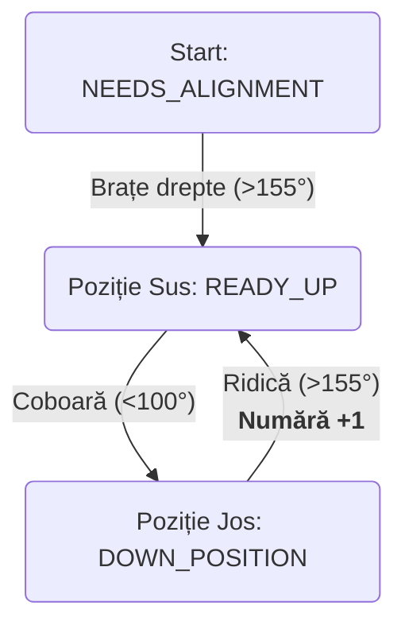

# Pushups Locker

O prezentare tehnică aprofundată

---
layout: default
---

# Ce este Pushups Locker?

**Pushups Locker** este o aplicație Android care blochează alte aplicații după o anumită perioadă de utilizare și solicită utilizatorului să execute un număr stabilit de flotări pentru a le debloca.

- **Scop:** Încurajează activitatea fizică prin limitarea timpului petrecut în aplicații.
- **Funcționalitate cheie:**
    - Selectarea și configurarea aplicațiilor de blocat.
    - Monitorizarea utilizării aplicațiilor în fundal.
    - Detectarea flotărilor în timp real folosind camera frontală și ML (Machine Learning).

---
layout: default
---

# Arhitectura Generală

Aplicația este compusă din trei componente principale care lucrează împreună:

1.  **UI Principal (`MainActivity`)**
    - Interfața pentru configurarea aplicației. Aici utilizatorii aleg ce aplicații să blocheze și stabilesc regulile (limită de timp, număr de flotări).

2.  **Serviciu de Monitorizare (`LockerService`)**
    - Un serviciu care rulează în fundal și urmărește ce aplicație este în prim-plan. Când o aplicație blocată depășește limita de timp, lansează ecranul de blocare.

3.  **Ecran de Blocare (`LockerActivity`)**
    - Preia controlul ecranului, activează camera și folosește ML Kit pentru a număra flotările. După finalizarea exercițiului, deblochează aplicația.

---
layout: default
---

# Componenta Cheie: `MainActivity.kt`

Acesta este panoul de control al aplicației.

- Afișează lista tuturor aplicațiilor instalate folosind un `RecyclerView`.
- Permite activarea/dezactivarea blocării pentru fiecare aplicație.
- Deschide un dialog (`AlertDialog`) pentru a configura **limita de timp** și **numărul de flotări**.
- Gestionează solicitarea permisiunilor necesare:
    - `USAGE_STATS`: Pentru a vedea ce aplicație rulează (`UsageStatsManager`).
    - `SYSTEM_ALERT_WINDOW`: Pentru a afișa ecranul de blocare (`Settings.canDrawOverlays`).
    - `CAMERA`: Pentru detectarea flotărilor.
- Pornește și oprește `LockerService` printr-un `FloatingActionButton`.

---
layout: default
---

# Componenta Cheie: `LockerService.kt`

Motorul de monitorizare al aplicației.

- Rulează ca un `Foreground Service` pentru a preveni închiderea sa de către sistem.
- Utilizează `UsageStatsManager.queryEvents` pentru a detecta eficient aplicația din prim-plan la fiecare secundă.
- Menține un cronometru individual pentru fiecare aplicație blocată, salvat în `SharedPreferences`.
- Când timpul expiră, lansează `LockerActivity` cu detaliile blocării.
- Afișează o notificare persistentă cu starea curentă (ex: "Timp rămas pentru YouTube: 04:32").
- Folosește un `BroadcastReceiver` pentru a primi semnalul de deblocare de la `LockerActivity`.

---
layout: default
---

# Deep Dive: Algoritmul de Detecție (1/3)

Cum transformăm un video într-un număr de flotări?

### Inițializare & Configurare
- Se folosește **ML Kit Pose Detection API** (`com.google.mlkit:pose-detection-accurate`).
- Detectorul este configurat pentru performanță în timp real:
    - `AccuratePoseDetectorOptions.STREAM_MODE`: Optimizează pentru analiza cadrelor succesive dintr-un video.
- Fiecare cadru de la `CameraX` este transformat într-un `InputImage` și trimis detectorului.

### Validarea Datelor
- **Pragul de încredere (Confidence Threshold):** Pentru fiecare punct cheie (umar, cot etc.), algoritmul verifică `landmark.inFrameLikelihood`. Se iau în calcul doar punctele cu o încredere de peste `0.6f`.
- **Mesaje de ghidare:** Dacă punctele esențiale (ex: umerii, coatele) nu sunt vizibile, utilizatorul este ghidat prin mesaje pe ecran, cum ar fi "Make sure your upper body is visible".

---
layout: default
---

# Deep Dive: Algoritmul de Detecție (2/3)

### Alinierea și Poziționarea
Algoritmul trebuie să înțeleagă cum este poziționat utilizatorul față de cameră.

1.  **Detecția Vederii (Frontală vs. Laterală):**
    - Se calculează lățimea umerilor (`dist(lS, rS)`).
    - Se calculează lungimea aproximativă a trunchiului (`dist(umar, sold)`).
    - Dacă `lățimea umerilor < lungimea trunchiului * 0.7`, se consideră **vedere laterală**. Altfel, este **vedere frontală**. Această distincție este crucială pentru a alege ce reguli să aplici.

2.  **Verificarea Poziției de Plank:**
    - În **vedere laterală**, corpul trebuie să fie orizontal. Se verifică dacă `dy` (diferența pe verticală între umăr și șold) nu este mult mai mare decât `dx`.
    - În **vedere frontală**, umerii trebuie să fie la același nivel. Se verifică panta dintre umeri.
    - Dacă aceste condiții nu sunt îndeplinite, starea rămâne `NEEDS_ALIGNMENT` și utilizatorul este ghidat.

---
layout: two-cols
---

# Deep Dive: Algoritmul de Detecție (3/3)

::left::

### Mașina de Stări (State Machine)
Numărarea se face printr-o mașină de stări simplă, bazată pe unghiul coatelor.

- **Stări Posibile:** `NEEDS_ALIGNMENT`, `READY_UP`, `DOWN_POSITION`.

- **Calcul Unghi:** Se folosește `atan2` pe coordonatele umărului, cotului și încheieturii pentru a calcula unghiul cotului.

- **Tranziții:**
    - `NEEDS_ALIGNMENT` -> `READY_UP`
        - Când: Unghiul coatelor > 155° (brațe drepte).
    - `READY_UP` -> `DOWN_POSITION`
        - Când: Unghiul < 100° (flexare).
    - `DOWN_POSITION` -> `READY_UP`
        - Când: Unghiul > 155° (întindere).
        - **Acțiune: Se numără o flotare!**

::right::

---
layout: default
---

# Instalare și Permisiuni

Aplicația va fi distribuită ca un fișier **APK**.

1.  **Transferă și instalează fișierul APK** pe dispozitivul tău Android.
    - *Va trebui probabil să acorzi permisiunea de a instala aplicații din surse necunoscute.*

2.  **Rulează pe un dispozitiv fizic.**
    - *Emulatorul nu va funcționa corect deoarece necesită o cameră reală pentru a detecta o persoană.*

3.  **Acordă permisiunile critice** (aplicația te va ghida):
    - **Usage Access** (Acces la utilizare).
    - **Display over other apps** (Afișare peste alte aplicații).
    - **Camera**.
    - **Ignore Battery Optimizations** (Ignorare optimizări baterie).

---
layout: default
---

# Configurare și Start

După ce aplicația este instalată și permisiunile sunt acordate:

1.  **Deschide aplicația Pushups Locker.**
2.  **Activează blocarea** pentru una sau mai multe aplicații din listă folosind comutatorul.
3.  **(Opțional)** Apasă pe o aplicație pentru a-i configura **limita de timp** și **numărul de flotări**.
4.  **Apasă butonul "Start Service"** din partea de jos a ecranului.

Serviciul de monitorizare va porni și va rula în fundal. Pictograma sa va fi vizibilă în bara de notificări.

---
layout: center
---

# Întrebări?
